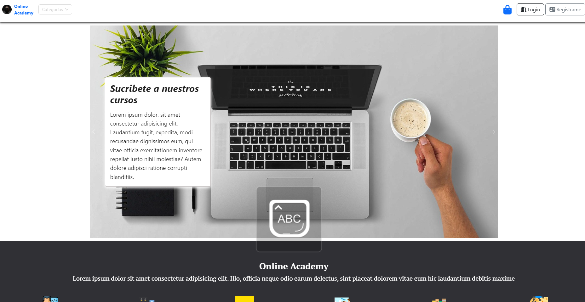
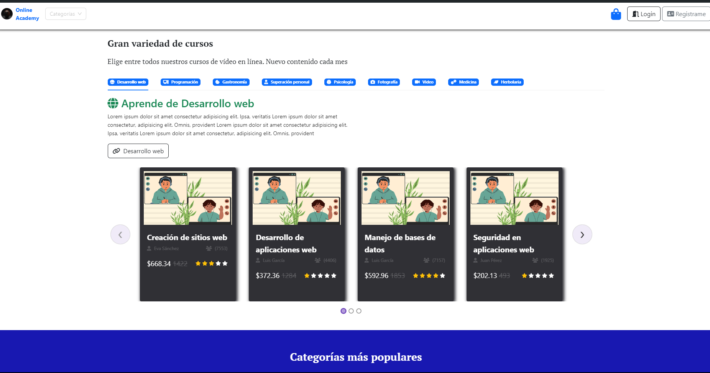
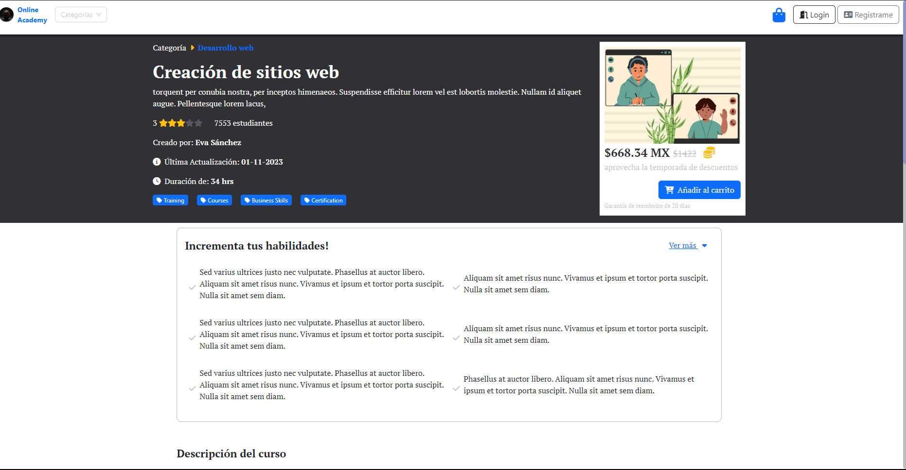
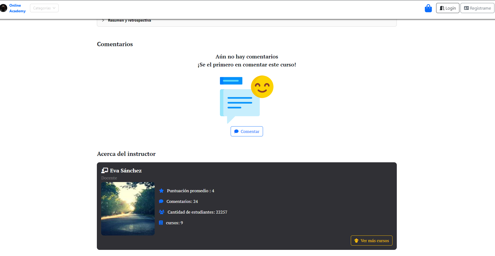
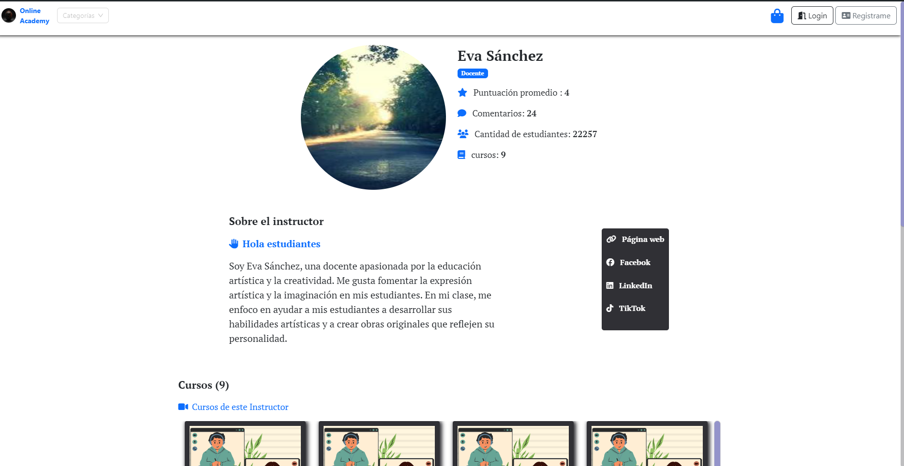
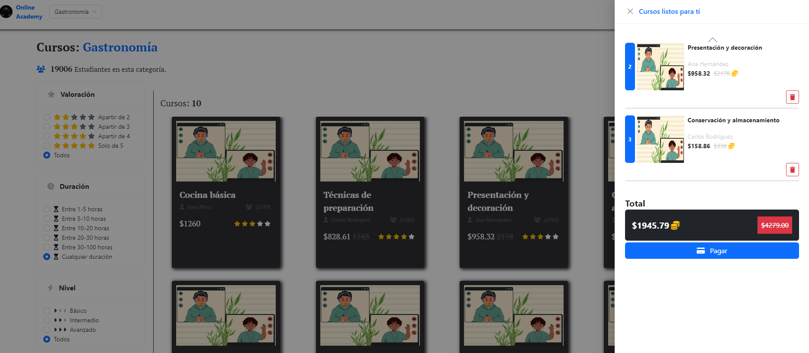
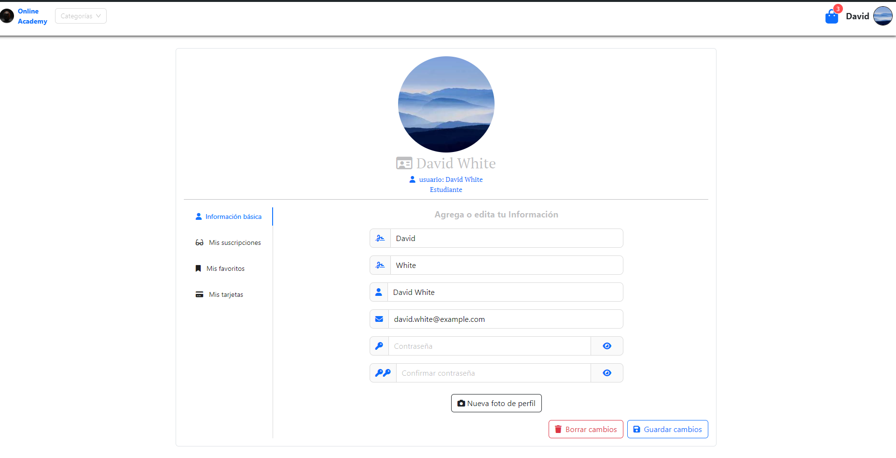
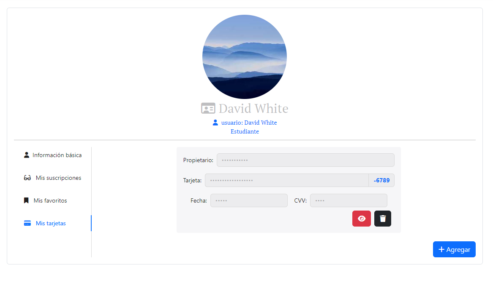

# Online academy

    Es un sitio inspirado en Udemy con un alcance menor.

    
  Esta realizado con React utilizando Typescript.

  No se hace uso de ninguna base de datos o backend, todo la información de usuarios, cursos, instructores, etc, se almacena y toma utilizando sessionStorage

## Acciones

Se puede:
- Navegar en el sitio sin tener sesión iniciada.
- Registro para inicio de sesión como estudiante (No como instructores aún).
- Agregar al carrito tus cursos.
- Agrear a tus favoritos tus cursos.
- Editar información en tu perfil.
- Acceder a cursos en base a categorias (Límitadas por ahora).
- Entrar al "Perfil" para ver más información de cada curso.
- Agregar un comentario a los cursos.
- Entrar al perfil del instructor y ver sus cursos relacionados.
- simular el pago de tus carrito mediante tarjeta (ingresar data fake) o pago con qr en "oxxo"

### Notas
    - Para poder visualizar el sitio de la forma adecuada, es necesario que si se clona, se agregue su propio link (kit) de FONTAWESOME https://fontawesome.com/ (con el de acceso gratuito es suficiente)

    - Aún NO es óptima para resoluciones pequeñas

LINK ==> https://developersbar.netlify.app/

